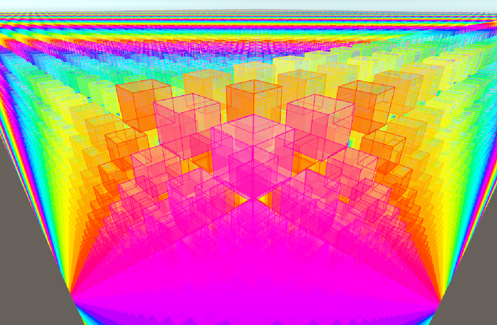

# Trove Debug Draw



## Installation

Refer to [Trove Readme](https://github.com/PhilSA/Trove/blob/main/README.md#installing-the-packages) for installation instructions.


## Overview

Trove Debug Draw is a GPU-persistent burst-compatible debug line/mesh drawer.


## How it works

Trove Debug Draw uses BatchRenderGroup. Make sure your project is compatible with BRG by consulting this page: https://docs.unity3d.com/6000.0/Documentation/Manual/batch-renderer-group-getting-started.html 

In this package, you create `DebugDrawGroup`s representing collections of GPU-persistent lines and triangles. If you don't change any `DebugDrawGroup`s, data will not have to be re-uploaded to the GPU, which will enable drawing lots of debug shapes at high performance.

#### Creating a DebugDrawGroup

Each system that wants to debug draw can store its own `DebugDrawGroup`. Systems are also responsible for allocating these `DebugDrawGroup`s by using the `AllocateDebugDrawGroup` function of the `DebugDrawSingleton`. 

Once a `DebugDrawGroup` is created, drawing is done by simply calling the various `Draw(...)` functions of the `DebugDrawGroup`. 

You should not call `Draw(...)` every frame if things are not changing. Once `Draw(...)` is called, the debug drawer will keep drawing that thing until the `DebugDrawGroup` is cleared.

```cs
partial struct TestDebugDrawSystem : ISystem
{
    private DebugDrawGroup _debugDrawGroup;
    
    public void OnCreate(ref SystemState state)
    {
        state.RequireForUpdate<DebugDrawSingleton>();
    }

    [BurstCompile]
    public void OnUpdate(ref SystemState state)
    {
        // Allocate the DebugDrawGroup if not created
        if (!_debugDrawGroup.IsCreated)
        {
            ref DebugDrawSingleton debugDrawSingleton = ref SystemAPI.GetSingletonRW<DebugDrawSingleton>().ValueRW;
            _debugDrawGroup = debugDrawSingleton.AllocateDebugDrawGroup();

            // On start, draw some shapes. These shapes will be drawn every frame until we clear the group
            _debugDrawGroup.DrawLine(start, end, color);
            _debugDrawGroup.DrawBox(start, quaternion.identity, extents, color);
        }

        // Since the DebugDrawGroup is GPU-persistent, we must manually clear it when we want to stop drawing (or when we want to update the things that this group is drawing)
        if((float)SystemAPI.Time.ElapsedTime > 5f)
        {
            _debugDrawGroup.Clear();
        }
    }
}
```

`DebugDrawGroup` can be passed to jobs, but can't be written to in parallel. For parallel writing, it is recommended to write debuf draw events to a `NativeStream` first, and then have a single-thread job that reads this stream and writes it to the `DebugDrawGroup`.