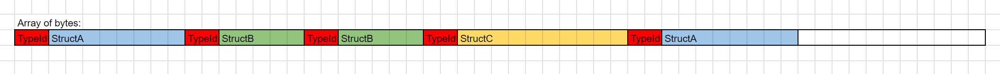

# How it works

Trove Polymorphic Elements are essentially a set of tools for writing structs of various sizes sequentially in memory (in arrays of bytes), as well as for reading these structs and calling a common function on each one.

Each "element" is a struct that has a specific `TypeId` (a `ushort` value) associated to its type. When polymorphic elements are written to a byte array, we first write the 2-byte `TypeId`, and then we write the struct:



We will explain how to work with this tool using polymorphic ordered events as an example use case.


## Defining elements

First we must define a Polymorphic Elements Group. All elements that belong to the same group will share the same functions and will be orderable relatively to eachother (they can all be written in sequence to the same byte array). We'll define a `PolymorphicElementsGroup` for our events:

```cs
[PolymorphicElementsGroup]
public interface IMyEvent
{
    void Process();
}
```

A Polymorphic Elements Group is any `interface` with the `[PolymorphicElementsGroup]` attribute. We've defined an `Process()` function, because all of our event types will have that function. Now let's define a Polymorphic Element for each of our event types:

```cs
[PolymorphicElement]
public struct SetPositionEvent : IMyEvent
{
    public Entity Entity;
    public float3 Position;

    public void Process()
    { }
}

[PolymorphicElement]
public struct SetRotationEvent : IMyEvent
{
    public Entity Entity;
    public quaternion Rotation;

    public void Process()
    { }
}

[PolymorphicElement]
public struct SetScaleEvent : IMyEvent
{
    public Entity Entity;
    public float Scale;

    public void Process()
    { }
}
```

We've defined three Polymorphic Elements: `SetPositionEvent`, `SetRotationEvent` and `SetScaleEvent`. A Polymorphic element is a `struct` marked with the `[PolymorphicElement]` attribute, and implementing an `interface` marked with the `[PolymorphicElementsGroup]` attribute (in this case; it's the `IMyEvent` interface).

However, our events can't really do anything yet, because they don't have access to any data. We'll give them access to data as a parameter to their `Process()` function:

```cs
public struct EventExecutionData
{
    public ComponentLookup<LocalTransform> LocalTransformLookup;
}

[PolymorphicElementsGroup]
public interface IMyEvent
{
    void Process(ref EventExecutionData data);
}

[PolymorphicElement]
public struct SetPositionEvent : IMyEvent
{
    public Entity Entity;
    public float3 Position;

    public void Process(ref EventExecutionData data)
    {
        RefRW<LocalTransform> transformRef = data.LocalTransformLookup.GetRefRW(Entity);
        if (transformRef.IsValid)
        {
            transformRef.ValueRW.Position = Position;
        }
    }
}

[PolymorphicElement]
public struct SetRotationEvent : IMyEvent
{
    public Entity Entity;
    public quaternion Rotation;

    public void Process(ref EventExecutionData data)
    {
        RefRW<LocalTransform> transformRef = data.LocalTransformLookup.GetRefRW(Entity);
        if (transformRef.IsValid)
        {
            transformRef.ValueRW.Rotation = Rotation;
        }
    }
}

[PolymorphicElement]
public struct SetScaleEvent : IEIMyEventvent
{
    public Entity Entity;
    public float Scale;

    public void Process(ref EventExecutionData data)
    {
        RefRW<LocalTransform> transformRef = data.LocalTransformLookup.GetRefRW(Entity);
        if (transformRef.IsValid)
        {
            transformRef.ValueRW.Scale = Scale;
        }
    }
}
```

We've defined a `EventExecutionData` struct that holds a `ComponentLookup<LocalTransform>` that our events can use to access entity transforms. Then, we've added this struct as a ref parameter to the `Process()` function of our interface. Each event type can now implement the `Process()` function to modify their target `Entity`'s transform accordingly. 

We've finished defining our Polymorphic Groups and Elements, and now we'll see how to create those Elements.


## Writing elements to a byte collection, and executing them

Trove Polymorphic Elements comes with C# source generators that generate code based on your `[PolymorphicElementsGroup]`s and `[PolymorphicElement]`s. Given an `IMyEvent` interface with a `[PolymorphicElementsGroup]`, a `IMyEventManager` will be generated. It's a static class that takes the name of the Group interface, and adds the `Manager` suffix. 

The `IMyEventManager` contains functions to write and read every Element type belonging to the `IMyEvent` group to a byte array. The supported collections to write/read to are:
- `NativeStream.Writer`/`NativeStream.Reader`
- custom streams implementing `IPolymorphicStreamWriter`/`IPolymorphicStreamReader`
- `DynamicBuffer<byte>`
- `NativeList<byte>`
- `UnsafeList<byte>`
- custom lists implementing `IPolymorphicList`

We can write elements to these collections using the `AppendElement` (for streams) and `AddElement` (for buffers/lists) generated functions of `IMyEventManager`, and we can execute a function of an element at a given byte index using the `Execute_MyFunctionName` generated functions. In the case of `IMyEventManager`, we have a `Execute_Process`, since our `IMyEvent` interface has the `Process()` function. Let's see how it works in code:

```cs
[BurstCompile]
public partial struct EventTestSystem : ISystem
{
    [BurstCompile]
    void OnCreate(ref SystemState state)
    {
        // Create an Entity that our events can affect
        Entity testEntity = state.EntityManager.CreateEntity();
        state.EntityManager.AddComponentData(testEntity, LocalTransform.Identity);

        // Create a list of bytes to hold our events of various types
        NativeList<byte> eventsList = new NativeList<byte>(1000, Allocator.Temp);

        // Write events of various types to the list (the order will be respected during execution)
        IMyEventManager.AddElement(ref eventsList, new SetPositionEvent
        {
            Entity = testEntity,
            Position = new float3(1f, 1f, 1f),
        });
        IMyEventManager.AddElement(ref eventsList, new SetScaleEvent
        {
            Entity = testEntity,
            Scale = 2f,
        });
        IMyEventManager.AddElement(ref eventsList, new SetScaleEvent
        {
            Entity = testEntity,
            Scale = 5f,
        });
        IMyEventManager.AddElement(ref eventsList, new SetRotationEvent
        {
            Entity = testEntity,
            Rotation = quaternion.Euler(1f, 0.5f, 0f),
        });
        IMyEventManager.AddElement(ref eventsList, new SetPositionEvent
        {
            Entity = testEntity,
            Position = new float3(5f, 2f, 3f),
        });

        // Create the data struct used by our events for their processing
        EventExecutionData data = new EventExecutionData
        {
            LocalTransformLookup = SystemAPI.GetComponentLookup<LocalTransform>(false),
        };

        // Execute the Process() function of every element.
        // This loop will keep iterating as long as we haven't reached the end of the elements in the eventsList.
        // IMyEventManager.Execute_Process returns true if it has found an element to read at the given elementStartByteIndex,
        // and it will then output the next element start byte index to elementStartByteIndex.
        int elementStartByteIndex = 0;
        while(IMyEventManager.Execute_Process(ref eventsList, elementStartByteIndex, out elementStartByteIndex, ref data))
        { }

        eventsList.Dispose();
    }
}
```

This example was all done on the main thread, but both element writing (`AddElement`) and executing (`Execute_Process`) can be called in bursted jobs.

Note that we can also alter this example to write events to a dynamic buffer on the entity whose transform is affected, instead of writing them to a global `NativeList`. We'll have to modify our events so that they gain access to component data directly rather than relying on a `ComponentLookup<LocalTransform>`:

```cs
public struct EventExecutionData
{
    public RefRW<LocalTransform> LocalTransform;
}

[PolymorphicElementsGroup]
public interface IMyEvent
{
    void Process(ref EventExecutionData data);
}

[PolymorphicElement]
public struct SetPositionEvent : IMyEvent
{
    public float3 Position;

    public void Process(ref EventExecutionData data)
    {
        data.LocalTransform.ValueRW.Position = Position;
    }
}

[PolymorphicElement]
public struct SetRotationEvent : IMyEvent
{
    public quaternion Rotation;

    public void Process(ref EventExecutionData data)
    {
        data.LocalTransform.ValueRW.Rotation = Rotation;
    }
}

[PolymorphicElement]
public struct SetScaleEvent : IMyEvent
{
    public float Scale;

    public void Process(ref EventExecutionData data)
    {
        data.LocalTransform.ValueRW.Scale = Scale;
    }
}

public struct MyEventsBufferElement : IBufferElementData
{
    public byte Value;
}

[BurstCompile]
public partial struct EventTestSystem : ISystem
{
    [BurstCompile]
    void OnCreate(ref SystemState state)
    {
        // Create an Entity that our events can affect
        Entity testEntity = state.EntityManager.CreateEntity();
        state.EntityManager.AddComponentData(testEntity, LocalTransform.Identity);

        // Add a dynamic buffer of bytes to the targeted entity hold our events of various types
        state.EntityManager.AddBuffer<MyEventsBufferElement>(testEntity);

        // Add events to entities that have a transform and a MyEventsBufferElement buffer
        foreach (var (localTransform, eventsBuffer) in SystemAPI.Query<RefRW<LocalTransform>, DynamicBuffer<MyEventsBufferElement>>())
        {
            // Reinterpret our buffer as a bytes buffer, so our IMyEventManager know how to work with it
            DynamicBuffer<byte> eventsByteBuffer = eventsBuffer.Reinterpret<byte>();

            // Add events to buffer on that entity
            IMyEventManager.AddElement(ref eventsByteBuffer, new SetPositionEvent
            {
                Position = new float3(1f, 1f, 1f),
            });
            IMyEventManager.AddElement(ref eventsByteBuffer, new SetScaleEvent
            {
                Scale = 2f,
            });
            IMyEventManager.AddElement(ref eventsByteBuffer, new SetScaleEvent
            {
                Scale = 5f,
            });
            IMyEventManager.AddElement(ref eventsByteBuffer, new SetRotationEvent
            {
                Rotation = quaternion.Euler(1f, 0.5f, 0f),
            });
            IMyEventManager.AddElement(ref eventsByteBuffer, new SetPositionEvent
            {
                Position = new float3(5f, 2f, 3f),
            });
        }

        // Execute events on entities that have a transform and a MyEventsBufferElement buffer
        foreach (var (localTransform, eventsBuffer) in SystemAPI.Query<RefRW<LocalTransform>, DynamicBuffer<MyEventsBufferElement>>())
        {
            // Reinterpret our buffer as a bytes buffer, so our IMyEventManager know how to work with it
            DynamicBuffer<byte> eventsByteBuffer = eventsBuffer.Reinterpret<byte>();

            // Create the data struct used by our events for their processing
            EventExecutionData data = new EventExecutionData
            {
                LocalTransform = localTransform,
            };

            // Execute the Process() function of every element.
            // This loop will keep iterating as long as we haven't reached the end of the elements in the eventsBuffer.
            // IMyEventManager.Execute_Process returns true if it has found an element to read at the given elementStartByteIndex,
            // and it will then output the next element start byte index to elementStartByteIndex.
            int elementStartByteIndex = 0;
            while (IMyEventManager.Execute_Process(ref eventsByteBuffer, elementStartByteIndex, out elementStartByteIndex, ref data))
            { }

            // Clear the buffer of events once we're done processing.
            // Note: if you wanted the events to stay there as a "stack of ordered actions to execute later",
            // you could choose to not clear the buffer.
            eventsByteBuffer.Clear();
        }
    }
}
```

We've created a `MyEventsBufferElement : IBufferElementData` to store the byte array of polymorphic elements on the target entity, instead of the `NativeList<byte>` we used before. This buffer type contains only a single `byte`, and we reinterpret it to a `DynamicBuffer<byte>` before writing to it.