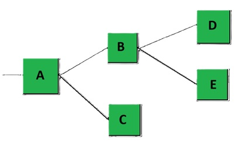

# Usage Patterns

**Table of Contents**
* [Polymorphic structs as a way to minimize structural changes or job counts](#polymorphic-structs-as-a-way-to-minimize-structural-changes-or-job-counts)
* [Polymorphic structs as a way to minimize buffer lookups](#polymorphic-structs-as-a-way-to-minimize-buffer-lookups)
* [Polymorphic structs as a way to handle type-independent ordering](#polymorphic-structs-as-a-way-to-handle-type-independent-ordering)
* [Polymorphic structs as a graph solving tool](#polymorphic-structs-as-a-graph-solving-tool)
* [Minimizing data size in Polymorphic Structs](#minimizing-data-size-in-polymorphic-structs)
* [Entity and Blob fields restriction workaround](#entity-and-blob-fields-restriction-workaround)


## Polymorphic structs as a way to minimize structural changes or job counts

Consider a use case where a single entity can change behaviour very often. Two typical ways of handling this is ECS would be:
* Use structural changes to remove the current behaviour component and add a new one on the entity.
* Une enableable components to enable the new behaviour component and disable the previous one.

There are cases where these will be the best solution for the job, but there are also cases where they won't. There is a certain point where the structural changes will be too costly (for the first approach), or at which the jobs overhead will be too costly (for the second approach). In these cases, polymorphic structs can be a better approach.

You would simply create a polymorphic `MyBehaviour` component, that can take many forms. When you want to change the behaviour, simply assign a new polymorphic struct sub-type to it, and the behaviour will change. This avoids both the cost of structural changes and the overhead of many jobs iterating enableable components.


## Polymorphic structs as a way to minimize buffer lookups

Consider a use case where you need to access 3 dynamic buffers on an entity via `BufferLookup`s. In a case like this, Polymorphic structs can offer a way to reduce this to 1 lookup (if it makes sense for the use case).

For example, let's say an entity must support 3 different types of events (stored in dynamic buffers on that entity and processed by a system): `DynamicBuffer<EventA>`, `DynamicBuffer<EventB>`, `DynamicBuffer<EventC>`. If something needs to add all 3 types of events on that entity, it will need to do 3 different buffer lookups in order to get all the event buffers. With Polymorphic structs, `EventA`, `EventB`, `EventC` could be turned into one single polymorphic `Event` type, stored in only one dynamic buffer. With this change, only one buffer lookup would be required for adding any amount of different types of events.


## Polymorphic structs as a way to handle type-independent ordering

Imagine you need to implement an ordered events system, where events of many different types must be executed in the exact order they were added: `EventTypeA`, then `EventTypeB`, then `EventTypeA`, `EventTypeC`, then `EventTypeB`, etc.... Polymorphic structs can solve this problem easily and efficiently. Simply turn all your events into a polymorphic struct type, have a single buffer of those events, and add the polymorphic events in order.


## Polymorphic structs as a graph solving tool

Polymorphic structs can be used as a general graph-solving tool. Consider this graph:



Let's say we need node A to receive a `float` input, and then this `float` value must receive a series of transformations while it flows through the other nodes, outputting different final values at nodes C, D, and E. This could be implemented as follows:
* Create a `INode` polymorphic interface type representing your nodes, with a `NodeUpdate()` method. 
    * For each type of node input your nodes will need, add a property to the `INode` interface for setting that input. Ex: `InputFloat {get;set;}`, `InputEntity {get;set;}`, etc....
* For each node you'll have in the graph, create a poly struct implementing `INode`. Each node can have fields to remember the indexes of its next nodes to pass outputs to (you can have a `FixedList` of output nodes as well, if you need a variable amount of outputs).
* With this, the whole graph transformation of our `float` input value would happen like this:
    * On node A, call `nodaA.InputFloat = 5f;`, then `nodeA.NodeUpdate();`.
    * In node A's `NodeUpdate()`, it does some transformation to the value of the `InputFloat` property, then for each output node index that it stored in its fields, calls `outputNode.InputFloat = transformedInput;`, and `outputNode.NodeUpdate()`.
    * Each node in the graph will continue this chain reaction of transformation of inputs, until we reach nodes that have no output nodes (nodes C, D, and E in this example). At this point we can get the output values from these nodes, perhaps with a new `GetOutput()` polymorphic method for the nodes.


## Minimizing data size in Polymorphic Structs

It is generally a good thing to try to minimize the amount of data contained as fields of polymorphic struct, for performance reasons. Especially if most polymorphic structs under the same polymorphic interface are small, except a few that are very large. Because in those cases, all structs will take on the max size of all structs, which will affect performance.

For that reason, for larger structs, it can be a good idea to store some data outside of the struct itself, such as in another component/buffer on the entity, or even on another dedicated Entity just for that struct (in extreme cases).


## Entity and Blob fields restriction workaround

If not using the [Merged Fields](./poly-struct-types.md/#merged-fields-struct) type of polymorphic structs, Entities and blob fields are not allowed in polymorphic structs. This is due to how ECS has special treatment for certain types of fields, and the union struct approach is incompatible with this special treatment. There are, however, alternatives to storing Entities in polymorphic structs.

#### Encompassing struct

The simplest alternative is to simply create a regular struct that encompasses the generated polymorphic struct:
```cs
public struct MyEncompassingStruct // This is the regular "encompassing struct"
{
    public Entity EntityA;
    public BlobString BlobStringA;

    public PolyMyStruct PolyStruct; // this is our generated polymorphic struct
}
```

Then, our polymorphic struct has a polymorphic method that takes the Entities/Blobs as parameters:
```cs
public void DoSomething(Entity entityA, in BlobString blobStringA, int val)
{
    // TODO: polymorphic method that does something with entities and blobs
}
```

So from our encompassing struct, we can invoke our polymorphic method like this:
```cs
myEncompassingStruct.PolyStruct.DoSomething(myEncompassingStruct.EntityA, in myEncompassingStruct.BlobStringA, val);
```


#### External storage

Another alternative is to store Entities/Blobs in a DynamicBuffer alongside wherever your polymorphic struct is stored. You could, for example, have a buffer of several Entities, and your polymorphic structs simply store an index to an entity in that buffer. The buffer is then passed as parameter to the polymorphic functions, so the entities can be gotten from there.

