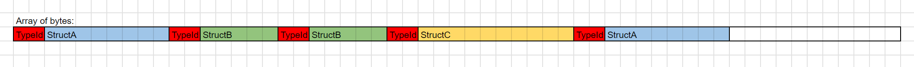

# Polymorphic Struct Types

## Union struct

Union struct polymorphic structs will create a union struct based on all the child structs (holds all child struct types at the same offset in memory, meaning the memory used is equivalent to the largest child struct). They can be created by using the `[PolymorphicStructInterface]` attribute on an interface, like so:
```cs
[PolymorphicStructInterface]
public interface IExampleA
{
    public void DoSomething(int p1);
}
```

See the [Generated Code](./generated-unionstruct.md) based on an example.

Pros:
* Easy to use.
* Good performance.

Cons:
* Doesn't allow Entity or Blob fields by default, unless you know what you're doing and you use the `[AllowEntitiesAndBlobsInPolymorphicStruct]` attribute on the polymorphic interface.
* Can waste space if there is a large discrepency in the sizes of your structs.


## Merged Fields struct

Merged Fields polymorphic structs will find the minimal set of fields of different types that can accomodate all the fields of child structs. They can be created by using the `[IsMergedFieldsPolymorphicStruct]` attribute on a polymorphic interface, like so:
```cs
[IsMergedFieldsPolymorphicStruct]
[PolymorphicStructInterface]
public interface IExampleB
{
    public void DoSomething(int p1);
}
```

See the [Generated Code](./generated-mergedfields.md) based on an example.

Pros:
* Easiest and safest to use.
* Best choice for polymorphic structs involved in Baking or Netcode, because they don't have any pitfalls related to Entity remapping or Blob fields. 

Cons:
* Does not support properties.
* Doesn't perform as well as the union struct approach.
* Can waste space if there is a large discrepency in the sizes of your structs.


## Byte Array reader/writer

In this approach, we start with a regular "Union struct" polymorphic struct, and we then use it as a way to read or write the struct to a byte array, as shown in this image:



Pros:
* Should have the best performance if there is a large discrepency in the sizes of your structs.

Cons:
* Least easy to use.
* Unsafe. Can't be involved with Baking or Netcode or saving/loading to disk at all. Only use if you know what you're doing.
* Doesn't allow Entity fields by default, unless you know what you're doing and you use the `[AllowEntitiesAndBlobsInPolymorphicStruct]` attribute on the polymorphic interface.
* Doesn't allow any struct fields involving pointers, like `NativeList<T>` fields, `BlobAssetReference<T>` fields, etc... The system won't show warnings for this.

The way we use this type of polymorphic struct is by coupling it with the various `PolymorphicObjectUtilities` utilities in the Trove Common package. The generated polymorphic struct implements `IPolymorphicObject`, which these utilities can work with. For example:

```cs
[PolymorphicStructInterface]
public interface IExampleA
{
    public void DoSomething(int p1);
}

[PolymorphicStruct]
public struct ExampleA1 : IExampleA
{
    public int A;
    
    public void DoSomething(int p1)
    { }
}

[PolymorphicStruct]
public struct ExampleA2 : IExampleA
{
    public int A;
    public int B;
    public float3 C;
    
    public void DoSomething(int p1)
    { }
}
```

```cs
NativeList<byte> bytesList = new NativeList<byte>(Allocator.Temp);

// Adds ExampleA1 to a list
PolyExampleA polyExample = new ExampleA1 { A = 1 };
PolymorphicObjectUtilities.AddObject(polyExample, ref bytesList, out int writeByteIndex1, out int writeSize1);

// Adds ExampleA2 to a list
polyExample = new ExampleA2 { A = 1 };
PolymorphicObjectUtilities.AddObject(polyExample, ref bytesList, out int writeByteIndex2, out int writeSize2);

// Reads ExampleA1 from the list
PolymorphicObjectUtilities.ReadObject(ref bytesList, writeByteIndex1, out polyExample, out int readSize);
Debug.Log($"Read ExampleA1.A = {((ExampleA1)polyExample).A}");

// Reads ExampleA2 from the list
PolymorphicObjectUtilities.ReadObject(ref bytesList, writeByteIndex2, out polyExample, out readSize);
Debug.Log($"Read ExampleA2.A = {((ExampleA2)polyExample).A}");

// Iterate polymorphic elements of the list and call a common function on them
PolymorphicObjectNativeListIterator<PolyExampleA> iterator = PolymorphicObjectUtilities.GetIterator<PolyExampleA>(bytesList);
while (iterator.GetNext(out PolyExampleA e, out _, out _))
{
    // Call a function on the iterated element
    e.DoSomething(2);
}
```