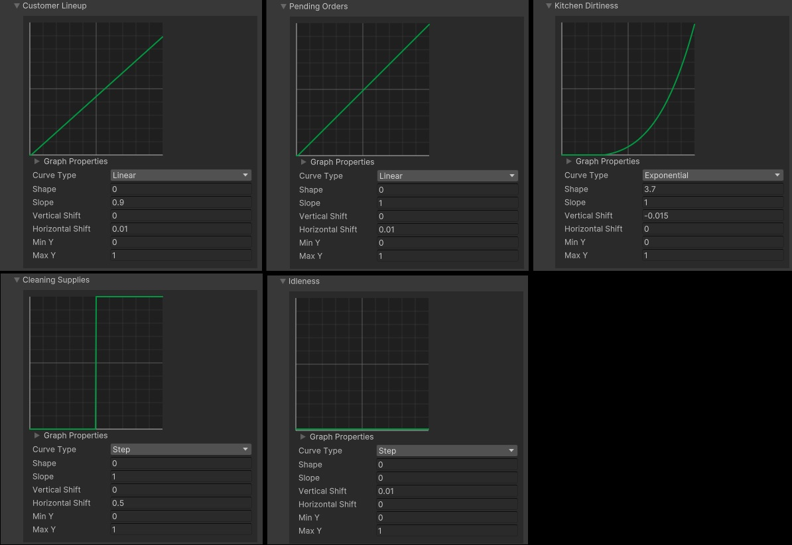

[How it works](./how-it-works.md)

# Completing the Restaurant example

In this section, we will go over a full implementation of the [Restaurant example](./how-it-works-intro.md) from the introduction section.

## Overview

Let's recap what we're trying to accomplish with this example scenario: 
* We have a restaurant with customers lining up to order food
* Our restaurant workers can choose between 3 actions
    * `Service` (take customer orders)
    * `Cook` (cook customer orders, which can make the kitchen dirty)
    * `Clean` (clean the kitchen)

We'll also add an `Idle` action to this, when a worker can't really do any of these other actions.


## The restaurant

First, let's see how the restaurant could be implemented. 

Our restaurant will be represented as a singleton entity with two components on it: `Restaurant` and `RestaurantState`. 

[Code: restaurant components](https://github.com/PhilSA/Trove/tree/main/_Projects/TroveTests/Assets/_Projects/_Restaurant/Scripts/Restaurant.cs)

The `RestaurantSystem` will only take care of adding new customers in line, in the `RestaurantState`:

[Code: restaurant system](https://github.com/PhilSA/Trove/tree/main/_Projects/TroveTests/Assets/_Projects/_Restaurant/Scripts/RestaurantSystem.cs)


## The restaurant worker

### Actions and Considerations

Our possible worker actions are represented by this enum:

```cs
public enum RestaurantWorkerAIAction
{
    Idle,
    Service,
    Cook,
    Clean,
}
```

And our consideration set curves are defined like this:




### Component

The restaurant worker component (`RestaurantWorkerAI`) holds the following data:
* The current selected action
* References to its Actions and Considerations
* Data about how fast the worker does certain things, or how much importance the worker gives to things lineup sizes or kitchen dirtiness
* Stateful (changing) data about worker task progress, timers, etc...

[Code: restaurant worker component](https://github.com/PhilSA/Trove/tree/main/_Projects/TroveTests/Assets/_Projects/_Restaurant/Scripts/RestaurantWorkerAI.cs)


### Authoring

Our worker authoring would be similar to what we covered in a previous section. The AI actions/considerations are set-up during baking:

[Code: restaurant worker authoring](https://github.com/PhilSA/Trove/tree/main/_Projects/TroveTests/Assets/_Projects/_Restaurant/Scripts/RestaurantWorkerAIAuthoring.cs)


### System

Finally, we have the restaurant worker system, where all the AI logic happens:

[Code: restaurant worker system](https://github.com/PhilSA/Trove/tree/main/_Projects/TroveTests/Assets/_Projects/_Restaurant/Scripts/RestaurantWorkerAISystem.cs)

## Conclusion

With this, we have restaurant workers that can take care of restaurant operations: taking customer orders, cooking meals, and keeping the kitchen clean. You could choose to add many workers to a restaurant, all with their own traits and characteristics, and they would all be able to work together to handle all the tasks that they need to do.
