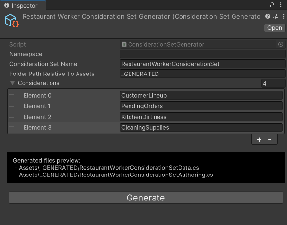
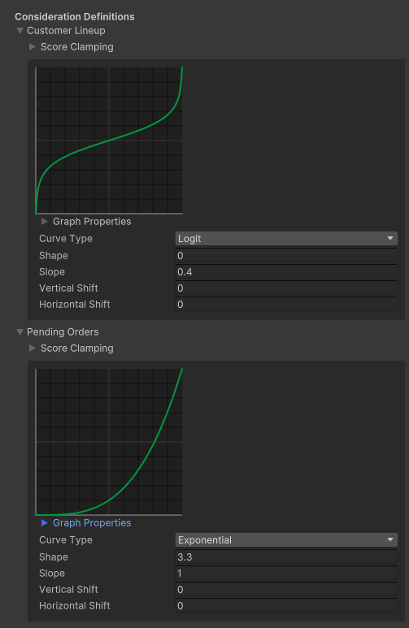

[How it works](./how-it-works.md)

# Setting up reasoners, actions, and considerations

When creating a new reasoner, we need to define all of the following:
* The action types that our reasoner can choose from.
* The consideration types and rules that are used by the actions.
* The authoring component of our reasoner.
* The relationships between our reasoner's actions and considerations,
* The references to our reasoner's actions and considerations, so that we can interact with them at runtime.

This section will cover all of these topics. We will continue with the "restaurant worker" example of the [Introduction](./how-it-works-intro.md) section.

-----------------------------------------

## Defining possible action types

In order to define the possible actions that a reasoner can choose from, simply define an enum in your code:

```cs
public enum RestaurantWorkerAIAction
{
    Service,
    Cook,
    Clean,
}
```

Since actions are nothing more than "identifiers" of things to do, this is all we have to do for now regarding actions.

-----------------------------------------

## Generating a consideration set

Now, we will define our types of considerations, and generate the code to support them. Considerations are defined in "consideration sets".

Follow these steps to generate a new consideration set for your AI:
* In the `Project` window, `right-click > Create > Trove > UtilityAI > ConsiderationSetGenerator`. 
* You will get to name a new ScriptableObject. We'll name it `RestaurantWorkerConsiderationSetGenerator`.
* Click on the new `RestaurantWorkerConsiderationSetGenerator` ScriptableObject.
* In the inspector, enter the following information about your new consideration set:
    * Namespace of the generated consideration set code
    * Name of the generated consideration set (we'll use `RestaurantWorkerConsiderationSet`)
    * Folder of the generated files (a box below gives you a preview of the generated files)
    * List of consideration types that this consideration set includes: `CustomerLineup`, `PendingOrders`, `KitchenDirtiness`, `CleaningSupplies`
* When you have filled out this info, click the `Generate` button at the bottom. Make sure to look at the console for errors/warnings in case you entered some invalid data in there.
* The new files will be generated in the folder you designated.



-----------------------------------------

## Editing a consideration set

Now, we will edit the data of the new consideration set we generated:
* In the `Project` window, `right-click > Create > Trove > UtilityAI > ConsiderationSets > RestaurantWorkerConsiderationSetData` (it will depend on the "Consideration Set Name" you entered when generating your consideration set).
* Click on the new `RestaurantWorkerConsiderationSetData` ScriptableObject that was created.
* In the inspector, you will be able to edit the response curve of each consideration type you defined. These represent how to calculate an score value (Y axis) from an input value (X axis) for this consideration.




-----------------------------------------

## Setting up the reasoner 

### Creating a component for our worker

First, we'll create a component to identify our restaurant worker AI, and store the `ActionReference`s and `ConsiderationReference`s to the actions and considerations we're about to create:

```cs
[Serializable]
public struct RestaurantWorkerAI : IComponentData
{
    // Store references to our action instances
    public ActionReference ServiceRef;
    public ActionReference CookRef;
    public ActionReference CleanRef;

    // Store references to our consideration instances
    public ConsiderationReference CustomerLineupRef;
    public ConsiderationReference PendingOrdersRef;
    public ConsiderationReference KitchenDirtinessRef;
    public ConsiderationReference CleaningSuppliesRef;
}
```

### Setting up actions and considerations during baking

Here's an example of how you'd set up the relationships between actions and considerations, and store references to them, during baking. See comments in code for further explanation:

```cs
using Unity.Entities;
using Unity.Mathematics;
using UnityEngine;
using Trove.UtilityAI;

[DisallowMultipleComponent]
public class RestaurantWorkerAIAuthoring : MonoBehaviour
{
    // With this field, we can assign the consideration set (the curves of each consideration) we 
    // defined in the inspector. 
    public RestaurantWorkerConsiderationSetData ConsiderationSetData;

    class Baker : Baker<RestaurantWorkerAIAuthoring>
    {
        public override void Bake(RestaurantWorkerAIAuthoring authoring)
        {
            // Create our restaurant worker component, but don't add it just yet (because we must set data in it first)
            RestaurantWorkerAI restaurantWorker = new RestaurantWorkerAI();

            // We bake our consideration set definitions to the entity (these are blob asset references to each consideration curve)
            authoring.ConsiderationSetData.Bake(this, out RestaurantWorkerConsiderationSet considerationSetComponent);

            // When we're ready to start adding actions and considerations, we call BeginBakeReasoner. This will give us
            // access to the components and buffers we need.
            ReasonerUtilities.BeginBakeReasoner(this, out Reasoner reasoner, out DynamicBuffer<Action> actionsBuffer, out DynamicBuffer<Consideration> considerationsBuffer, out DynamicBuffer<ConsiderationInput> considerationInputsBuffer);
            {
                // Add our actions. We specify an action type using our enum, and we store the resulting
                // "ActionReference" in our restaurant worker component.
                ReasonerUtilities.AddAction(new ActionDefinition((int)RestaurantWorkerAIAction.Service), true, ref reasoner, actionsBuffer, out restaurantWorker.ServiceRef);
                ReasonerUtilities.AddAction(new ActionDefinition((int)RestaurantWorkerAIAction.Cook), true, ref reasoner, actionsBuffer, out restaurantWorker.CookRef);
                ReasonerUtilities.AddAction(new ActionDefinition((int)RestaurantWorkerAIAction.Clean), true, ref reasoner, actionsBuffer, out restaurantWorker.CleanRef);

                // Add our considerations to our actions. We use the "ConsiderationDefinition"s from our consideration set
                // in order to specify the type of consideration to add, and we also specify the "ActionReference" that we
                // want to add this consideration to. Finally, we store the resulting "ConsiderationReference" in our 
                // restaurant worker component.
                ReasonerUtilities.AddConsideration(considerationSetComponent.CustomerLineup, ref restaurantWorker.ServiceRef, true, ref reasoner, actionsBuffer, considerationsBuffer, considerationInputsBuffer, out restaurantWorker.CustomerLineupRef);
                ReasonerUtilities.AddConsideration(considerationSetComponent.PendingOrders, ref restaurantWorker.CookRef, true, ref reasoner, actionsBuffer, considerationsBuffer, considerationInputsBuffer, out restaurantWorker.PendingOrdersRef);
                ReasonerUtilities.AddConsideration(considerationSetComponent.KitchenDirtiness, ref restaurantWorker.CleanRef, true, ref reasoner, actionsBuffer, considerationsBuffer, considerationInputsBuffer, out restaurantWorker.KitchenDirtinessRef);
                ReasonerUtilities.AddConsideration(considerationSetComponent.CleaningSupplies, ref restaurantWorker.CleanRef, true, ref reasoner, actionsBuffer, considerationsBuffer, considerationInputsBuffer, out restaurantWorker.CleaningSuppliesRef);
            }
            // Once we're finished setting everything up, we end baking for the reasoner
            ReasonerUtilities.EndBakeReasoner(this, reasoner);

            // Add our worker ai component, after it's been filled with all added action/consideration references
            AddComponent(GetEntity(), restaurantWorker);

            // Let the baking system know that we depend on that consideration set SriptableObject, so that
            // baking is properly re-triggered when it changes.
            DependsOn(authoring.ConsiderationSetData);
        }
    }
}
```

With this baker, the following components will be added to the entity:
* `Reasoner` (added by `ReasonerUtilities.EndBakeReasoner`)
* `DynamicBuffer<Action>` (added by `ReasonerUtilities.BeginBakeReasoner`)
* `DynamicBuffer<Consideration>` (added by `ReasonerUtilities.BeginBakeReasoner`)
* `RestaurantWorkerAI` (added explicitly by us)
* `RestaurantWorkerConsiderationSet` (added by `authoring.ConsiderationSetData.Bake(this)`)


### Setting up actions and considerations at runtime

Here's an example of how you'd set up the relationships between actions and considerations, and store references to them, at runtime.

First, imagine we never added those actions and considerations during baking. Our baker would look like this:

```cs
using Unity.Entities;
using Unity.Mathematics;
using UnityEngine;
using Trove.UtilityAI;

[DisallowMultipleComponent]
public class RestaurantWorkerAIAuthoring : MonoBehaviour
{
    // With this field, we can assign the consideration set (the curves of each consideration) we 
    // defined in the inspector. 
    public RestaurantWorkerConsiderationSetData ConsiderationSetData;

    class Baker : Baker<RestaurantWorkerAIAuthoring>
    {
        public override void Bake(RestaurantWorkerAIAuthoring authoring)
        {
            // Add our restaurant worker component
            AddComponent(GetEntity(), new RestaurantWorkerAI());

            // Bake the basic reasoner components
            ReasonerUtilities.BeginBakeReasoner(this, out Reasoner reasoner, out DynamicBuffer<Action> actionsBuffer, out DynamicBuffer<Consideration> considerationsBuffer, out DynamicBuffer<ConsiderationInput> considerationInputsBuffer);
            ReasonerUtilities.EndBakeReasoner(this, reasoner);

            // Bake our consideration set definitions to the entity
            authoring.ConsiderationSetData.Bake(this);
            // Let the baking system know that we depend on that consideration set SriptableObject, so that
            // baking is properly re-triggered when it changes.
            DependsOn(authoring.ConsiderationSetData);
        }
    }
}
```

Then, we'd create a system + job that handles the initialization of our restaurant workers, using a `RestaurantWorkerInitialized` tag component to mark the entity as initialized:

```cs
using Unity.Burst;
using Unity.Entities;
using Unity.Mathematics;
using Unity.Collections;
using Trove.UtilityAI;

[BurstCompile]
public partial struct RestaurantWorkerAISystem : ISystem
{
    [BurstCompile]
    void OnUpdate(ref SystemState state)
    {
        RestaurantWorkerAIInitializeJob initializeJob = new RestaurantWorkerAIInitializeJob
        {
            ECB = SystemAPI.GetSingletonRW<BeginSimulationEntityCommandBufferSystem.Singleton>().ValueRW.CreateCommandBuffer(state.WorldUnmanaged),
        };
        state.Dependency = initializeJob.Schedule(state.Dependency);
    }

    [BurstCompile]
    [WithNone(typeof(RestaurantWorkerInitialized))]
    public partial struct RestaurantWorkerAIInitializeJob : IJobEntity
    {
        public EntityCommandBuffer ECB;

        void Execute(Entity entity, ref RestaurantWorkerAI restaurantWorker, in RestaurantWorkerConsiderationSet considerationSet, ref Reasoner reasoner, ref DynamicBuffer<Action> actionsBuffer, ref DynamicBuffer<Consideration> considerationsBuffer)
        {
            // Add our actions. We specify an action type using our enum, and we store the resulting
            // "ActionReference" in our restaurant worker component.
            ReasonerUtilities.AddAction(new ActionDefinition((int)RestaurantWorkerAIAction.Service), true, ref reasoner, actionsBuffer, out restaurantWorker.ServiceRef);
            ReasonerUtilities.AddAction(new ActionDefinition((int)RestaurantWorkerAIAction.Cook), true, ref reasoner, actionsBuffer, out restaurantWorker.CookRef);
            ReasonerUtilities.AddAction(new ActionDefinition((int)RestaurantWorkerAIAction.Clean), true, ref reasoner, actionsBuffer, out restaurantWorker.CleanRef);

            // Add our considerations to our actions. We use the "ConsiderationDefinition"s from our consideration set
            // in order to specify the type of consideration to add, and we also specify the "ActionReference" that we
            // want to add this consideration to. Finally, we store the resulting "ConsiderationReference" in our 
            // restaurant worker component.
            ReasonerUtilities.AddConsideration(considerationSet.CustomerLineup, ref restaurantWorker.ServiceRef, true, ref reasoner, actionsBuffer, considerationsBuffer, considerationInputsBuffer, out restaurantWorker.CustomerLineupRef);
            ReasonerUtilities.AddConsideration(considerationSet.PendingOrders, ref restaurantWorker.CookRef, true, ref reasoner, actionsBuffer, considerationsBuffer, considerationInputsBuffer, out restaurantWorker.PendingOrdersRef);
            ReasonerUtilities.AddConsideration(considerationSet.KitchenDirtiness, ref restaurantWorker.CleanRef, true, ref reasoner, actionsBuffer, considerationsBuffer, considerationInputsBuffer, out restaurantWorker.KitchenDirtinessRef);
            ReasonerUtilities.AddConsideration(considerationSet.CleaningSupplies, ref restaurantWorker.CleanRef, true, ref reasoner, actionsBuffer, considerationsBuffer, considerationInputsBuffer, out restaurantWorker.CleaningSuppliesRef);

            ECB.AddComponent(entity, new RestaurantWorkerInitialized());
        }
    }
}
```

As you can see, the APIs for adding actions/considerations at runtime are exactly the same as during baking.


### What if two different actions share the same consideration?

Let's say, just as an example, that `CustomerLineup` was also a consideration for the `Clean` action, on top of being a consideration for the `Service` action. Maybe so that we'll never choose to start cleaning if there are customers waiting in line.

In this case, we'd simply have to duplicate the consideration (call `ReasonerUtilities.AddConsideration` one time for the `Service` action, and another time for the `Clean` action, storing the two resulting `ConsiderationReference`s separately). Having one single consideration instance being used by several actions is not supported, as this would severely impact the performance of the whole system.


### Can a reasoner use multiple consideration sets?

Yes, you could add multiple consideration set ScriptableObjects to your authorings/bakers, and call `myConsiderationSet.Bake(this)` on each one of them. You are free to split up your consideration sets for your project in the way that seems best to you. You could have only one consideration set for all the considerations in your project, or your could have one consideration set per consideration. You can go as granular (or not) as you want.


### Why isn't there a user-friendly editor window for setting up all of this?

It's because you must store "references" to the actions/considerations you create during setup in order to use them at runtime, and every project or reasoner will have a different best way to store these. This becomes much more obvious when working with AIs that are more complex than what we're showing in this tutorial (AIs with arrays of actions, multiple instances of the same consideration type, etc...).

For this reason, creating a user-friendly tool to setup AIs in editor windows would be the responsibility of the programmers on your team, for your specific project and your specific AIs. Creating such tools would more or less just involve code-generating the authoring component or the initialization job we created earlier, based on some lists of actions and considerations that are defined in the inspector by designers.


### Final remarks

In most cases, you will probably want to do a bit of both (some setup during baking, and some at runtime). AIs will often have some built-in actions and considerations, but some will be added procedurally at runtime.

Also note that despite the "Reference" name, there is nothing managed, unsafe, or pointer-related about `ActionReference` and `ConsiderationReference`. These just cache entities, indexes, versions and IDs in order to efficiently retrieve `Action` and `Consideration` buffer elements by index.

In the next section, we'll see how to actually update and work with the AI at runtime.